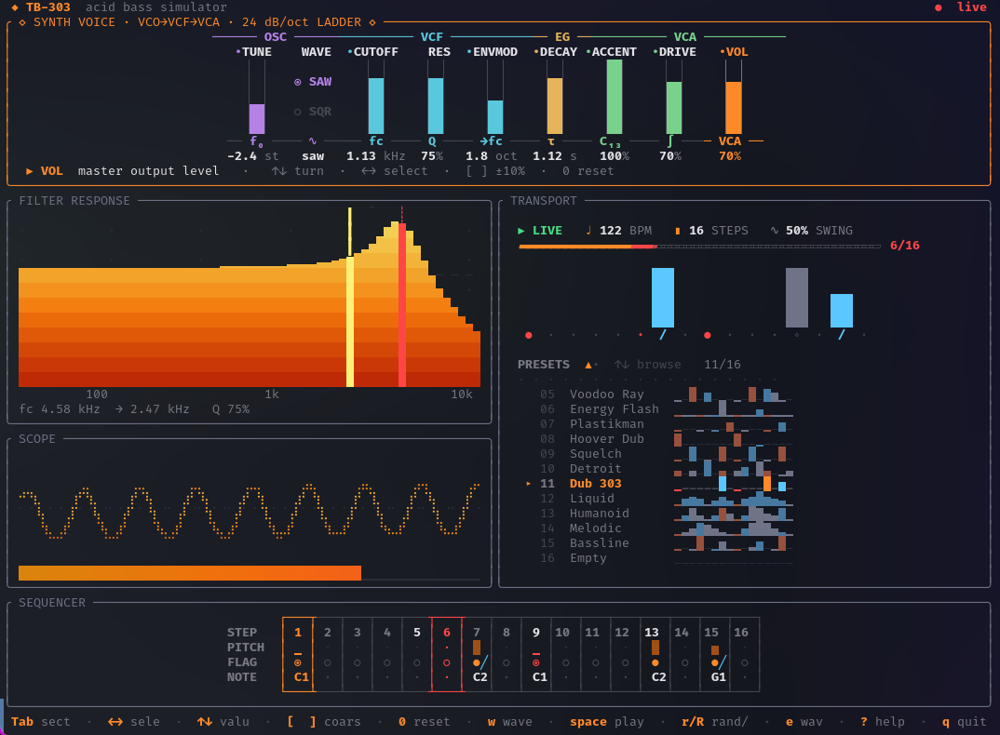

<p align="center">
  
</p>

<h1 align="center">acidflow</h1>

<p align="center">
  A <b>Roland TB-303</b> acid bass simulator that lives in your terminal.<br>
  ZDF ladder filter. 16-step sequencer. Live scope. Mouse support. No GUI toolkit.
</p>

<p align="center">
  <a href="#install">Install</a> · <a href="#quickstart">Quickstart</a> · <a href="MANUAL.md">Manual</a> · <a href="#how-it-sounds">How it sounds</a> · <a href="#under-the-hood">Internals</a>
</p>

<p align="center">
  
  
  
  
  
</p>

---

The TB-303 ate the back end of dance music in 1987 and never gave it back. **acidflow** is the whole instrument — oscillator, ladder filter, accent envelope, sequencer, slides — modelled from circuit analysis and rendered as a terminal app you actually want to look at.

Type `space` to play. Press `r` to randomize. Drag a knob. Export a WAV. Quit before you finish your next track.

## Features

- **Authentic 303 DSP.** ZDF/TPT 4-pole ladder with per-stage tanh and global feedback tanh — the diode-junction non-linearity that makes a 303 *squelch* instead of *whine*. 2× oversampling kills high-Q aliasing. Exponential V/oct envelope modulation, persistent accent capacitor that stacks across notes, exponential slide RC with τ ≈ 88 ms, ±3 cent VCO drift.
- **9 knobs that mean what their pots mean.** TUNE · WAVE · CUTOFF · RES · ENVMOD · DECAY · ACCENT · DRIVE · VOL. Cutoff: 13 Hz – 5 kHz log. Decay: 0.2–2 s. Envmod: 0–4 octaves. Tuning: ±12 st. Resonance self-oscillates around 90% — same as the real circuit.
- **16-step sequencer** with per-step accent / slide / rest, swing (50% straight → 75% hard shuffle), variable pattern length (4–16), and **16 hardcoded presets** inspired by *Acid Tracks*, *Higher State*, *Energy Flash*, *Voodoo Ray*, *Acperience*, Hardfloor, Plastikman, and friends.
- **Live oscilloscope** (Braille-cell, zero-crossing triggered) and **filter response heatmap** that *moves with the envelope* so you can see the squelch.
- **Full mouse support.** Click + drag knobs vertically. Scroll to fine-tune. Right-click to reset. Click a step to edit it. Scroll on the title to nudge BPM.
- **Smart randomizer.** Four character archetypes (classic / squelchy / driving / dubby) for knobs; four groove archetypes (pedal / driving / melodic / dub) for patterns. No flat dice rolls — every randomization is musical.
- **9 user save slots** (`Shift-1`…`Shift-9` to save, `1`…`9` to load).
- **WAV export** — bounce 4 loops to `~/.config/acidflow/bounce.wav` at 44.1 kHz / 16-bit PCM.
- **Cross-platform.** Linux (ALSA), macOS (CoreAudio), Windows (WASAPI). One DSP engine, three backends.
- **Lock-free audio.** UI ↔ audio thread communication is atomic-only. Per-sample 15 ms parameter smoothing kills knob zipper. ~5–6 ms output latency.

## Install

You need a C++26 compiler (recent GCC or Clang), CMake ≥ 3.28, and a sibling checkout of [`maya`](https://github.com/1ay1/maya) — the TUI framework acidflow is built on.

```bash
# Linux: install ALSA dev headers
sudo apt-get install libasound2-dev      # Debian/Ubuntu
sudo dnf install alsa-lib-devel          # Fedora
sudo pacman -S alsa-lib                  # Arch

# Clone with maya as a sibling
git clone https://github.com/1ay1/maya.git
git clone https://github.com/1ay1/acidflow.git
cd acidflow

# Build
cmake -B build
cmake --build build -j

# Run
./build/acidflow
```

macOS: same recipe — the CoreAudio backend is picked automatically.

Windows: use a Visual Studio generator (MSVC toolchain from VS 2022 or 2026) and pass `--config Release` because the generator is multi-config:

```bat
cmake -B build -G "Visual Studio 18 2026" -A x64
cmake --build build --config Release
.\build\Release\acidflow.exe
```

The CMake script falls back to C++23 under MSVC (current MSVC doesn't advertise `cxx_std_26` to CMake) and adds `_USE_MATH_DEFINES` + `/utf-8` for MSVC only. GCC/Clang builds stay on C++26. Run the binary in a terminal that speaks ANSI + UTF-8 (Windows Terminal, WezTerm, Alacritty) — the legacy `cmd.exe` console won't render it correctly.

## Quickstart

```
Tab      cycle focus (Knobs → Sequencer → Transport)
Space    play / pause
? / Esc  open / close the keyboard reference
r / R    randomize current section / everything
e        export current pattern as WAV (4 loops)
q        quit
```

In the **Knobs** section: `← →` selects, `↑ ↓` adjusts by 5%, `[ ]` by 10%, `0` resets, `w` toggles waveform.
In the **Sequencer**: `← →` selects step, `↑ ↓` semitone, `< >` octave, `a` accent, `s` slide, `m` mute, `x` clear, `c d e f g a b` set root pitch.
In **Transport**: `↑ ↓` browse presets, `[ ]` BPM ±2, `{ }` pattern length, `- =` swing.

The full keyboard map (and every mouse interaction) is one `?` away inside the app, and lives in the **[Manual](MANUAL.md)**.

## How it sounds

Load a preset and play with the cutoff. That's it. That's the demo.

The presets are evocations of canonical acid records — not lifted MIDI, but plausible reconstructions of the patterns those tracks are built on. Pair the right preset with the right knob settings and you'll hear *Acid Tracks*-the-feeling, not *Acid Tracks*-the-sample:

| Preset | Try this |
|---|---|
| **Acid Tracks** | classic knobs · 122 BPM · slowly raise cutoff bar by bar |
| **Higher State** | very long decay · cutoff at 30% · let it open over 32 bars |
| **Energy Flash** | drive at 60% · resonance at 80% · 132 BPM |
| **Plastikman** | low cutoff · high res · long decay · half the steps muted |
| **Liquid** | every note slides — you don't have to do anything else |

Hit `R` (capital) repeatedly until something grabs you. The randomizer is intentionally good at finding *playable* patches.

## Under the hood

Three concerns, cleanly separated:

```
src/main.cpp       ── TUI, sequencer, input handling, preset/slot I/O, WAV export
src/engine.cpp     ── Platform-agnostic DSP (oscillator, filter, envelopes, VCA)
src/audio_*.cpp    ── One per platform (ALSA / CoreAudio / WASAPI), spawns audio thread
src/tb303/*.hpp    ── Custom widgets (knob, sequencer, scope, filter response, ...)
```

The audio thread runs `acid::render(buf, 256)` and blocks on the OS device. The UI thread updates `std::atomic` parameters with relaxed ordering; the audio thread snapshots them per block and one-pole smooths at 15 ms. Note triggers go through a single `seq` counter (acquire / release) — no mutexes, no allocations on the audio path, ever.

If you want the deep version of all of that, plus every keystroke documented and every knob explained — that's in **[MANUAL.md](MANUAL.md)**.

## Built on

- **[maya](https://github.com/1ay1/maya)** — the C++26 TUI framework that does the rendering, layout, and event loop.

## Status

acidflow is a personal project, but it's complete enough to make actual music with. Bug reports and pattern submissions welcome.
